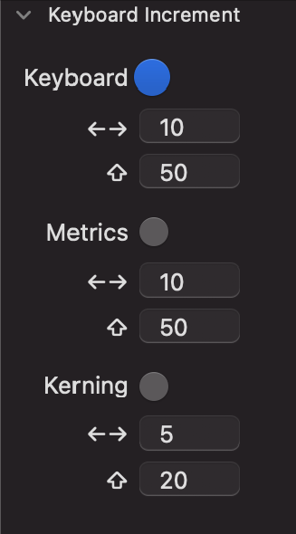
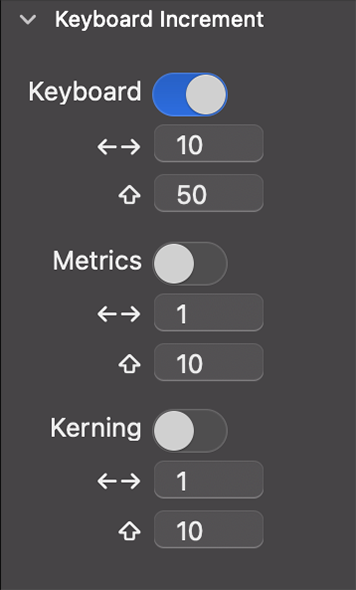

# Keyboard Increment
### Works on Glyphs 2 and 3, Mac OS 10.15 or later

## About

This is a total remodeling of the older plug-in published in 2018 and moved here:

*Keyboard Increment* is a palette plug-in for the Glyphs.app’s font editor. It allows you to change the default value — which is 1 unit using the arrows or 10 units adding shift – for whatever value you want to. You can also individually configure different values for the regular use of the arrow keys (i.e. moving something around), to change the left and right sidebearing (⌃ or ⌘ + ← or →) or the kerning (⌘ + ⌥ + ← or →).

You can also change the increment for the higher value — the one that you access adding the shift key (⇧).

*After installation, Keyboard Increment will appear in the app palette on the right side (⌘ + ⌥ + P).*

### For Mac OS 10.13 and 10.14
There is a version that works on older Mac OSs that can be found here:

The only difference is on the UI, that can't use that nice switcher. This version was kindly tested by Deia Kulpas and Rafael Dietzsch on Mac OS High Sierra using Glyphs 2.

## Usage

1) When the switcher is on, the **Keyboard** will only affect the Select Tool's keyboard increment (white arrow). The first option (← →) will change how the arrow keys work and, the second option (⇧) will alter how the keyboard behaves when pressing shift + one of the arrows. **For Glyphs 2 users:** a known issue is that this second option won't work on Glyphs 2, so it will remain work as ten units movement.

2) Likewise, the **Metrics**, when on, will change how the keyboard works when spacing a font (i.e., adjusting the left and right sidebearings). That means that it will modify the shortcut Ctrl (⌃) + arrow or Cmd (⌘) + arrow keys, moving left and right sidebearing for whatever value you add to the plugin's text field. For more information on how to deal with spacing on Glyphs App, check the @mekkablue's tutorial on [https://glyphsapp.com/learn/spacing](https://glyphsapp.com/learn/spacing).

3) The **Kerning** affects, of course, the kerning related shortcuts. For me, it is probably the most useful of the three options. As you may guess, if the kerning switcher is on, it will change the Ctrl (⌘) + Opt (⌥) + right or left keys. If this is a mystery for you, go to [https://glyphsapp.com/learn/kerning](https://glyphsapp.com/learn/kerning).

## Installation

1. Open *Window > Plugin Manager*
2. Find *Keyboard Increment (Mac OS 10.15 and bellow)* and click the *Install* button
3. Restart Glyphs.app

## License

Copyright 2020 Filipe Negrão Nogueira (@filipenegrao).

Licensed under the Apache License, Version 2.0 (the "License"); you may not use this file except in compliance with the License. You may obtain a copy of the License at [http://www.apache.org/licenses/LICENSE-2.0](http://www.apache.org/licenses/LICENSE-2.0)
