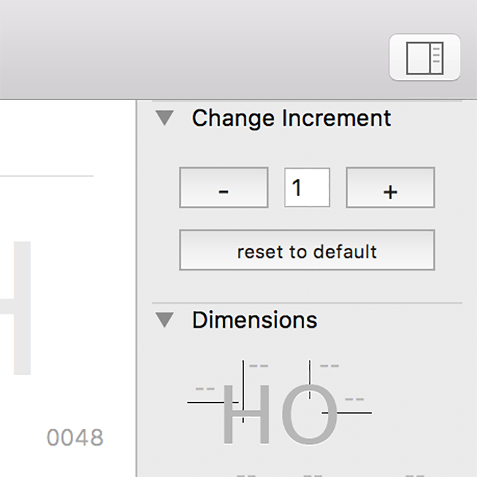

# Glyphs App Plugins

## Change Increment
Change Increment is a Palette Plugin for [Glyphs App](http://glyphsapp.com/).

It changes the default keyboard increment values to a settable new one. After installation will show up as a dialog in Glyphs.app’s sidebar on the right edge of the application window (*Window > Palette* or ⌥ + ⌘ + p).

### Installation

1. Download the ZIP file and unpack it, or clone this repository.
2. Double click the .glyphsFilter file and confirm.
3. Restart Glyphs App

### Usage Instructions

I think the usage is pretty much self-explanatory, but one hidden trick is that you can use the shortcuts *⌘ + arrow up* or *down* to change the increment's value. And to reset to the default values, it is possible to *Fn + ⌘ + delete*. 

### Requirements

The plugin was tested with Glyphs 2.5. It will probably work on 2.4, but I assume it will not work in earlier versions.

### License
Copyright 2018 Filipe Negrão (@filipenegrao).

Licensed under the Apache License, Version 2.0 (the "License");
you may not use this file except in compliance with the License.
You may obtain a copy of the License at

http://www.apache.org/licenses/LICENSE-2.0

See the License file included in this repository for further details.
